Bellabeat Case Study
================
Josh Mercado

<figure>

<figcaption aria-hidden="true">This sample case study was provided
through the Google Data Analytics Professional Certificate
course.</figcaption>
</figure>

# 1. Ask

### Scenario

You are a junior data analyst working on the marketing analyst team at
Bellabeat, a high-tech manufacturer of health-focused products for
women. Bellabeat is a successful small company, but they have the
potential to become a larger player in the global smart device market.
Urška Sršen, cofounder and Chief Creative Officer of Bellabeat, believes
that analyzing smart device fitness data could help unlock new growth
opporunities for the company. You have been asked to focus on one of
Bellabeat’s products and analyze smart device data to gain insight into
how consumers are using their smart devices. The insights you discover
will then help guide marketing strategy for the company. You will
present your analysis to the Bellabeat executive team along with your
high-level recommendations for Bellabeat’s marketing strategy.

Urška Sršen and Sando Mur founded Bellabeat, a high-tech company that
manufactures health-focused smart products. Sršen used her background as
an artist to develop beautifully designed technology that informs and
inspires women around the world. Collecting data on activity, sleep,
stress, and reproductive health has allowed Bellabeat to empower women
with knowledge about their own health and habits. Since it was founded
in 2013, Bellabeat has grown rapidly and quickly positioned itself as a
tech-driven wellness company for women.

By 2016, Bellabeat had opened offices around the world and launched
multiple products. Bellabeat products became available through a growing
number of online retailers in addition to their own e-commerce channel
on their website. The company has invested in traditional advertising
media, such as radio, out-of-home billboards, print, and television, but
focuses on digital marketing extensively. Bellabeat invests year-round
in Google Search, maintaining active Facebook and Instagram pages, and
consistently engages consumers on Twitter. Additionally, Bellabeat runs
video ads on Youtube and display ads on the Google Display Network to
support campaigns around key marketing dates.

Sršen asks you to analyze smart device usage data in order to gain
insight into how consumers use non-Bellabeat smart devices.

### These questions will guide your analysis:

1.  What are some trends in smart device usage?
2.  How could these trends apply to Bellabeat customers?
3.  How could these trends help influence Bellabeat marketing strategy?

# 2. Prepare

## Data Collection

We will be using the following data: [FitBit Fitness Tracker
Data](https://www.kaggle.com/datasets/arashnic/fitbit) (CC0: Public
Domain, dataset made available through
[Mobius](https://www.kaggle.com/arashnic)): This Kaggle data set
contains personal fitness tracker from from 3/12/2016 - 5/12/2016.
Fitbit users consented to the submission of personal tracker data. It
includes information about daily activity that can be used to explore
users’ habits.

### Environment Set-Up

``` r
# Load the packages
library(tidyverse)
library(janitor)
library(data.table)
library(tools)
```

``` r
# Import the data into a list of data tables
path <- "Git Repos/My Repos/bellabeat-fitness-tracker/data/FitBit_Fitness_Tracker_Data/mturkfitbit_export_3.12.16-4.11.16"
csv_files <- list.files(path = path, pattern = "\\.csv$",
                        recursive = TRUE,
                        full.names = TRUE)

unclean_data_tables1 <- map(csv_files, fread) %>% 
  set_names(file_path_sans_ext(basename(csv_files)))

path <- "Git Repos/My Repos/bellabeat-fitness-tracker/data/FitBit_Fitness_Tracker_Data/mturkfitbit_export_4.12.16-5.12.16"
csv_files <- list.files(path = path,
                        pattern = "\\.csv$",
                        recursive = TRUE,
                        full.names = TRUE)

unclean_data_tables2 <- map(csv_files, fread) %>% 
  set_names(file_path_sans_ext(basename(csv_files)))
```

# 3. Process

## Data Cleaning

#### There is a lot of data in 29 total data tables, so our first step will be to simply remove any data tables aren’t of use to us. The minute tables are far too granular, so we can get rid of those.

``` r
# We'll use the more efficient negative indices rather than searching for substrings
unclean_data_tables1 <- unclean_data_tables1[-c(6:10)]
unclean_data_tables2 <- unclean_data_tables2[-c(9:16)]
```

#### Now that we have 2 lists of the same data (except for sleep data) from different time periods, we can combine based on their shared column names.

``` r
# Get all unique names from both lists
table_names <- unique(c(names(unclean_data_tables1), names(unclean_data_tables2)))

# Combine the lists
unclean_data_tables <- lapply(table_names, function(name) {
  if (name %in% names(unclean_data_tables1) && name %in% names(unclean_data_tables2)) {
    # If the table is in both lists, join on matching column names
    rbindlist(list(unclean_data_tables1[[name]], unclean_data_tables2[[name]]), use.names = TRUE, fill = TRUE)
  } else {
    # If the table is only in one of the lists (like "sleepDay_merged"), use it as is
    unclean_data_tables2[[name]]
  }
})

# Name the elements of the combined list
names(unclean_data_tables) <- table_names
```

#### Now that we have a single list of data tables, we can clean the individual tables and further explore.

``` r
# Clean the column names for consistency by converting to snake case
dt_list <- lapply(unclean_data_tables, clean_names)

# Remove any instance of "total" in column names as total is implied and change "step" to "steps"
dt_list <- lapply(dt_list, function(dt) {
  setnames(dt, names(dt), gsub("^total_|_total$|_total_", "", names(dt)))
  setnames(dt, names(dt), gsub("^step$", "steps", names(dt)))
})

# We need to create consistent date column names for a merge - this is easy because every date column is the second column
lapply(dt_list, function(dt) {
  setnames(dt, 2, "date", skip_absent = TRUE)
})
```

``` r
# Now we can see how many unique users and days logged each data table has to ensure we have a large enough sample size
lapply(dt_list, function(dt) {
  dt[, .(unique_dates = uniqueN(date)), by = id]
})
```

#### All of the data tables have at least 30 unique users (desired minimum sample size) besides heart rate, sleep, and weight. Sleep is close at 24, so we’ll keep it in for practice. Heart rate and weight are exceptionally low, so we’ll exclude those from our analysis.

``` r
dt_list <- dt_list[-c(2, 6)]
```

#### Next, we’ll perform some checks.

``` r
# Check for duplicate rows
lapply(dt_list, function(dt) {
  sum(duplicated(dt) | duplicated(dt, fromLast = TRUE))
})
```

    ## $dailyActivity_merged
    ## [1] 0
    ## 
    ## $hourlyCalories_merged
    ## [1] 350
    ## 
    ## $hourlyIntensities_merged
    ## [1] 350
    ## 
    ## $hourlySteps_merged
    ## [1] 350
    ## 
    ## $dailyCalories_merged
    ## [1] 0
    ## 
    ## $dailyIntensities_merged
    ## [1] 0
    ## 
    ## $dailySteps_merged
    ## [1] 0
    ## 
    ## $sleepDay_merged
    ## [1] 6

``` r
# Remove duplicate rows
dt_list <- lapply(dt_list, unique)

# Check for NA values
lapply(dt_list, function(dt) {
  colSums(is.na(dt))
})
```

    ## $dailyActivity_merged
    ##                         id                       date 
    ##                          0                          0 
    ##                      steps                   distance 
    ##                          0                          0 
    ##           tracker_distance logged_activities_distance 
    ##                          0                          0 
    ##       very_active_distance moderately_active_distance 
    ##                          0                          0 
    ##      light_active_distance  sedentary_active_distance 
    ##                          0                          0 
    ##        very_active_minutes      fairly_active_minutes 
    ##                          0                          0 
    ##     lightly_active_minutes          sedentary_minutes 
    ##                          0                          0 
    ##                   calories 
    ##                          0 
    ## 
    ## $hourlyCalories_merged
    ##       id     date calories 
    ##        0        0        0 
    ## 
    ## $hourlyIntensities_merged
    ##                id              date         intensity average_intensity 
    ##                 0                 0                 0                 0 
    ## 
    ## $hourlySteps_merged
    ##    id  date steps 
    ##     0     0     0 
    ## 
    ## $dailyCalories_merged
    ##       id     date calories 
    ##        0        0        0 
    ## 
    ## $dailyIntensities_merged
    ##                         id                       date 
    ##                          0                          0 
    ##          sedentary_minutes     lightly_active_minutes 
    ##                          0                          0 
    ##      fairly_active_minutes        very_active_minutes 
    ##                          0                          0 
    ##  sedentary_active_distance      light_active_distance 
    ##                          0                          0 
    ## moderately_active_distance       very_active_distance 
    ##                          0                          0 
    ## 
    ## $dailySteps_merged
    ##    id  date steps 
    ##     0     0     0 
    ## 
    ## $sleepDay_merged
    ##             id           date  sleep_records minutes_asleep    time_in_bed 
    ##              0              0              0              0              0

``` r
# No NA values
```

#### The daily activity table already contains information about calories, intensities, and steps. We need to check to see if it’those individual tables are redundant.

``` r
# Helper function
compare_tables <- function(dt_list, x_index, y_index, match_cols) {
  
  # Count the total rows in the smaller data table
  total_rows_y <- nrow(dt_list[[y_index]])
  
  # Find the matching rows and calculate the percentage of the smaller data table that matches 
  matching_rows <- dt_list[[x_index]][dt_list[[y_index]], on = match_cols, nomatch = 0L]
  num_matching_rows <- nrow(matching_rows)
  percentage <- (num_matching_rows / total_rows_y) * 100
  
  list(
    total_rows_y = total_rows_y,
    matching_rows = num_matching_rows,
    percentage = percentage
  )
}

# Compare the tables
compare_tables(dt_list, 1, 5, c("id", "date", "calories"))
```

    ## $total_rows_y
    ## [1] 940
    ## 
    ## $matching_rows
    ## [1] 940
    ## 
    ## $percentage
    ## [1] 100

``` r
compare_tables(dt_list, 1, 6, c("id", "date", c(names(dt_list$dailyIntensities_merged))))
```

    ## $total_rows_y
    ## [1] 940
    ## 
    ## $matching_rows
    ## [1] 940
    ## 
    ## $percentage
    ## [1] 100

``` r
compare_tables(dt_list, 1, 7, c("id", "date", "steps"))
```

    ## $total_rows_y
    ## [1] 940
    ## 
    ## $matching_rows
    ## [1] 940
    ## 
    ## $percentage
    ## [1] 100

``` r
# All of the data is redundant so we can remove those tables
dt_list <- dt_list[-c(5:7)]
```

``` r
# The last step before merging is to convert dates to consistent formats. This will be easier by splitting the data table list into daily and hourly lists.
daily_list <- dt_list[c(1, 5)]
hourly_list <- dt_list[2:4]

daily_list <- lapply(daily_list, function(dt) {
  dt[, date := parse_date_time(date, orders = c("mdy", "mdy HMS p"))]
}) # We need the more flexible parse_date_time() function to handle multiple formats

hourly_list <- lapply(hourly_list, function(dt) {
  dt[, date := mdy_hms(date)]
})
```

``` r
# Now we can finally extract our daily and hourly data tables from the lists based on id and date
daily_activity <- Reduce(function(x, y) merge(x, y, all.x = TRUE, by = c("id", "date")), daily_list) # We want to use a left join here because we want the sleep data
hourly_activity <- Reduce(function(x, y) merge(x, y, all = TRUE, by = c("id", "date")), hourly_list) # We want an outer join here because all of the data is equally important for analysis
```

``` r
# Check our work
summary(daily_activity)
```

    ##        id                  date                            steps      
    ##  Min.   :1503960366   Min.   :2016-03-12 00:00:00.00   Min.   :    0  
    ##  1st Qu.:2320127002   1st Qu.:2016-04-09 00:00:00.00   1st Qu.: 3146  
    ##  Median :4445114986   Median :2016-04-19 00:00:00.00   Median : 6999  
    ##  Mean   :4781210221   Mean   :2016-04-19 01:26:35.13   Mean   : 7281  
    ##  3rd Qu.:6962181067   3rd Qu.:2016-04-30 00:00:00.00   3rd Qu.:10544  
    ##  Max.   :8877689391   Max.   :2016-05-12 00:00:00.00   Max.   :36019  
    ##                                                                       
    ##     distance      tracker_distance logged_activities_distance
    ##  Min.   : 0.000   Min.   : 0.000   Min.   :0.0000            
    ##  1st Qu.: 2.170   1st Qu.: 2.160   1st Qu.:0.0000            
    ##  Median : 4.950   Median : 4.950   Median :0.0000            
    ##  Mean   : 5.219   Mean   : 5.192   Mean   :0.1315            
    ##  3rd Qu.: 7.500   3rd Qu.: 7.480   3rd Qu.:0.0000            
    ##  Max.   :28.030   Max.   :28.030   Max.   :6.7271            
    ##                                                              
    ##  very_active_distance moderately_active_distance light_active_distance
    ##  Min.   : 0.000       Min.   :0.0000             Min.   : 0.000       
    ##  1st Qu.: 0.000       1st Qu.:0.0000             1st Qu.: 1.610       
    ##  Median : 0.100       Median :0.2000             Median : 3.240       
    ##  Mean   : 1.397       Mean   :0.5385             Mean   : 3.193       
    ##  3rd Qu.: 1.830       3rd Qu.:0.7700             3rd Qu.: 4.690       
    ##  Max.   :21.920       Max.   :6.4800             Max.   :12.510       
    ##                                                                       
    ##  sedentary_active_distance very_active_minutes fairly_active_minutes
    ##  Min.   :0.000000          Min.   :  0.00      Min.   :  0.0        
    ##  1st Qu.:0.000000          1st Qu.:  0.00      1st Qu.:  0.0        
    ##  Median :0.000000          Median :  2.00      Median :  6.0        
    ##  Mean   :0.001704          Mean   : 19.68      Mean   : 13.4        
    ##  3rd Qu.:0.000000          3rd Qu.: 30.00      3rd Qu.: 18.0        
    ##  Max.   :0.110000          Max.   :210.00      Max.   :660.0        
    ##                                                                     
    ##  lightly_active_minutes sedentary_minutes    calories    sleep_records  
    ##  Min.   :  0.0          Min.   :   0.0    Min.   :   0   Min.   :1.000  
    ##  1st Qu.:111.0          1st Qu.: 729.0    1st Qu.:1799   1st Qu.:1.000  
    ##  Median :195.0          Median :1057.0    Median :2114   Median :1.000  
    ##  Mean   :185.4          Mean   : 992.5    Mean   :2266   Mean   :1.123  
    ##  3rd Qu.:262.0          3rd Qu.:1244.0    3rd Qu.:2770   3rd Qu.:1.000  
    ##  Max.   :720.0          Max.   :1440.0    Max.   :4900   Max.   :3.000  
    ##                                                          NA's   :975    
    ##  minutes_asleep   time_in_bed   
    ##  Min.   : 58.0   Min.   : 61.0  
    ##  1st Qu.:361.0   1st Qu.:403.8  
    ##  Median :432.5   Median :463.5  
    ##  Mean   :419.9   Mean   :459.2  
    ##  3rd Qu.:491.5   3rd Qu.:526.0  
    ##  Max.   :796.0   Max.   :961.0  
    ##  NA's   :975     NA's   :975

``` r
summary(hourly_activity)
```

    ##        id                  date                           calories     
    ##  Min.   :1503960366   Min.   :2016-03-12 00:00:00.00   Min.   : 42.00  
    ##  1st Qu.:2320127002   1st Qu.:2016-03-26 12:00:00.00   1st Qu.: 62.00  
    ##  Median :4558609924   Median :2016-04-10 10:30:00.00   Median : 80.00  
    ##  Mean   :4869940441   Mean   :2016-04-10 17:02:57.23   Mean   : 95.82  
    ##  3rd Qu.:6962181067   3rd Qu.:2016-04-25 16:00:00.00   3rd Qu.:106.00  
    ##  Max.   :8877689391   Max.   :2016-05-12 15:00:00.00   Max.   :948.00  
    ##    intensity      average_intensity     steps        
    ##  Min.   :  0.00   Min.   :0.00000   Min.   :    0.0  
    ##  1st Qu.:  0.00   1st Qu.:0.00000   1st Qu.:    0.0  
    ##  Median :  2.00   Median :0.03333   Median :   21.0  
    ##  Mean   : 11.42   Mean   :0.19037   Mean   :  302.9  
    ##  3rd Qu.: 15.00   3rd Qu.:0.25000   3rd Qu.:  323.0  
    ##  Max.   :180.00   Max.   :3.00000   Max.   :10565.0

``` r
# We know that steps and calories should probably not be zero or even close to zero, so let's remove any rows below 100 steps or 1000 calories as those were probably days that the wearable was not worn for the majority of the day.
daily_activity <- daily_activity[!(steps < 100 | calories < 1000)]
```

# 4. Analyze

## Data Transformation

### We’ll create new columns for more granular analysis.

``` r
# Weekday, date, and hour columns
hourly_activity[, datetime := format(date, "%Y-%m-%d %H:%M:%S")] # Convert to string for easier parsing by Excel and Tableau
hourly_activity[, hour := hour(date)]
hourly_activity[, date := date(date)]
hourly_activity[, weekday := weekdays(date)]

daily_activity[, weekday := weekdays(date)]

# Make sure the days of the week are ordered correctly
weekday_order <- c("Sunday", "Monday", "Tuesday", "Wednesday", "Thursday", "Friday", "Saturday")

hourly_activity$weekday <- factor(hourly_activity$weekday, levels = weekday_order)
daily_activity$weekday <- factor(daily_activity$weekday, levels = weekday_order)

# Percent of day tracked by dividing the total minutes tracked by a maximum 1440 minutes in a day
daily_activity[, percent_tracked := (very_active_minutes + fairly_active_minutes + lightly_active_minutes + sedentary_minutes) / 1440]

# Sleep quality score which is a percentage of total time in bed that the user is asleep
daily_activity$sleep_score <- daily_activity$minutes_asleep / daily_activity$time_in_bed

# Daily intensity score that takes into account all active minutes. The American Heart Association recommends 150 minutes of moderate intensity or 75 minutes of vigorous intensity per week. Therefore we'll assign .5 points for lightly active minutes, 1 points for fairly active minutes, and 2 points for very active minutes.
daily_activity$intensity_score <- daily_activity$very_active_minutes * 2 + daily_activity$fairly_active_minutes + daily_activity$lightly_active_minutes * 0.5
```

### We can create a classification of the day’s activity level based on steps. We’ll get our category ranges from the Tudor-Locke and Bassett classification system.

``` r
steps_breaks <- c(0, 5000, 7500, 10000, 12500, max(daily_activity[,steps]))
steps_labels <- c("Sedentary", "Physically Inactive", "Moderately Active", "Physically Active", "Very Active")

daily_activity[, daily_activity_category := cut(steps,
                                       breaks = steps_breaks,
                                       labels = steps_labels,
                                       include.lowest = TRUE)]

# Make sure that the categories are ordered correctly
daily_activity$daily_activity_category <- factor(daily_activity$daily_activity_category, levels = steps_labels)
```

### Next, we’ll create new data tables with the averages of the metrics grouped by weekday, ID, and hour

``` r
# Create a list of column names that we want to average
numeric_avg_cols <- names(daily_activity)[sapply(daily_activity, is.numeric)]
numeric_avg_cols <- numeric_avg_cols[-1] # We don't need to find the averages of the ID column

# Grouped by weekday
weekday_avgs <- daily_activity[order(weekday), lapply(.SD, mean, na.rm = TRUE), by = weekday, .SDcols = numeric_avg_cols]

# Grouped by id
id_avgs <- daily_activity[, lapply(.SD, mean, na.rm = TRUE), by = id, .SDcols = numeric_avg_cols]

# Grouped by hour
hourly_avg_cols <- c("calories", "intensity", "steps")
hourly_avgs <- hourly_activity[, lapply(.SD, mean, na.rm = TRUE), by = hour, .SDcols = hourly_avg_cols]
```

``` r
# We can apply our steps categorization to users' average scores rather than their daily scores
id_avgs[, user_category := cut(steps,
                                       breaks = steps_breaks,
                                       labels = steps_labels,
                                       include.lowest = TRUE)]

# Make sure that the categories are ordered correctly
id_avgs$user_category <- factor(id_avgs$user_category, levels = steps_labels)

# Merge our user category with the activity tables
daily_activity <- merge(daily_activity, id_avgs[, .(id, user_category)], by = "id")
hourly_activity <- merge(hourly_activity, id_avgs[, .(id, user_category)], by = "id")
```

``` r
# Check that we didn't create any unwanted NA values (besides sleep data)
colSums(is.na(daily_activity))
```

    ##                         id                       date 
    ##                          0                          0 
    ##                      steps                   distance 
    ##                          0                          0 
    ##           tracker_distance logged_activities_distance 
    ##                          0                          0 
    ##       very_active_distance moderately_active_distance 
    ##                          0                          0 
    ##      light_active_distance  sedentary_active_distance 
    ##                          0                          0 
    ##        very_active_minutes      fairly_active_minutes 
    ##                          0                          0 
    ##     lightly_active_minutes          sedentary_minutes 
    ##                          0                          0 
    ##                   calories              sleep_records 
    ##                          0                        814 
    ##             minutes_asleep                time_in_bed 
    ##                        814                        814 
    ##                    weekday            percent_tracked 
    ##                          0                          0 
    ##                sleep_score            intensity_score 
    ##                        814                          0 
    ##    daily_activity_category              user_category 
    ##                          0                          0

``` r
colSums(is.na(hourly_activity))
```

    ##                id              date          calories         intensity 
    ##                 0                 0                 0                 0 
    ## average_intensity             steps          datetime              hour 
    ##                 0                 0                 0                 0 
    ##           weekday     user_category 
    ##                 0                 0

## Data Analysis

``` r
# Summary Statistics
summary(daily_activity[, .(steps,
                       very_active_minutes,
                       fairly_active_minutes,
                       lightly_active_minutes,
                       sedentary_minutes,
                       calories,
                       minutes_asleep,
                       time_in_bed,
                       percent_tracked,
                       sleep_score,
                       intensity_score,
                       user_category)])
```

    ##      steps       very_active_minutes fairly_active_minutes
    ##  Min.   :  108   Min.   :  0.00      Min.   :  0.00       
    ##  1st Qu.: 4790   1st Qu.:  0.00      1st Qu.:  0.00       
    ##  Median : 7891   Median :  6.00      Median :  8.00       
    ##  Mean   : 8302   Mean   : 22.39      Mean   : 14.77       
    ##  3rd Qu.:11100   3rd Qu.: 34.00      3rd Qu.: 21.00       
    ##  Max.   :36019   Max.   :210.00      Max.   :143.00       
    ##                                                           
    ##  lightly_active_minutes sedentary_minutes    calories    minutes_asleep
    ##  Min.   :  0.0          Min.   :  99.0    Min.   :1002   Min.   : 58   
    ##  1st Qu.:147.0          1st Qu.: 724.0    1st Qu.:1878   1st Qu.:361   
    ##  Median :212.0          Median :1018.0    Median :2225   Median :432   
    ##  Mean   :211.5          Mean   : 958.6    Mean   :2378   Mean   :419   
    ##  3rd Qu.:272.0          3rd Qu.:1188.0    3rd Qu.:2839   3rd Qu.:490   
    ##  Max.   :720.0          Max.   :1440.0    Max.   :4900   Max.   :796   
    ##                                                          NA's   :814   
    ##   time_in_bed    percent_tracked   sleep_score     intensity_score
    ##  Min.   : 61.0   Min.   :0.2146   Min.   :0.4984   Min.   :  0.0  
    ##  1st Qu.:402.5   1st Qu.:0.6840   1st Qu.:0.9119   1st Qu.:102.0  
    ##  Median :462.0   Median :0.9396   Median :0.9431   Median :163.0  
    ##  Mean   :458.3   Mean   :0.8384   Mean   :0.9165   Mean   :165.3  
    ##  3rd Qu.:526.0   3rd Qu.:1.0000   3rd Qu.:0.9606   3rd Qu.:218.5  
    ##  Max.   :961.0   Max.   :1.0000   Max.   :1.0000   Max.   :555.5  
    ##  NA's   :814                      NA's   :814                     
    ##              user_category
    ##  Sedentary          :188  
    ##  Physically Inactive:362  
    ##  Moderately Active  :316  
    ##  Physically Active  :272  
    ##  Very Active        : 83  
    ##                           
    ## 

- Average steps is 8302, below the recommended amount of 10000, but well
  above the American average of 3000 - 4000 (according to the Mayo
  Clinic).
- Average intensity score is 167.6 which is far above the recommended
  amount of 22.
- Average sedentary time is 958 minutes or 15.97 hours per day, but the
  max is 1440 minutes, so we assume that sedentary time includes time in
  bed.
- We unfortunately don’t have enough sleep data to accurately determine
  how much of the sedentary minutes occurred while the user was awake.
- We can see that most users use their device for over 83%. 100% would
  be better, but we can still glean insight.
- Users sleep 419 minutes or just about 7 hours on average.
- The National Sleep institute recommends 7-9 hours of sleep, so most
  users are hitting the minimum, which is better than over a third of
  Americans.
- A WebMD survey (one of the few that distuingishes time asleep from
  time in bed) found that on average, Americans spend only 5.7 hours
  asleep while spending 7.67 hours in bed (our users’ averages are 6.98
  hours alsleep and 7.63 hours in bed).

``` r
summary(hourly_activity)
```

    ##        id                  date               calories        intensity     
    ##  Min.   :1503960366   Min.   :2016-03-12   Min.   : 42.00   Min.   :  0.00  
    ##  1st Qu.:2320127002   1st Qu.:2016-03-26   1st Qu.: 62.00   1st Qu.:  0.00  
    ##  Median :4558609924   Median :2016-04-10   Median : 80.00   Median :  2.00  
    ##  Mean   :4869940441   Mean   :2016-04-10   Mean   : 95.82   Mean   : 11.42  
    ##  3rd Qu.:6962181067   3rd Qu.:2016-04-25   3rd Qu.:106.00   3rd Qu.: 15.00  
    ##  Max.   :8877689391   Max.   :2016-05-12   Max.   :948.00   Max.   :180.00  
    ##                                                                             
    ##  average_intensity     steps           datetime              hour      
    ##  Min.   :0.00000   Min.   :    0.0   Length:46008       Min.   : 0.00  
    ##  1st Qu.:0.00000   1st Qu.:    0.0   Class :character   1st Qu.: 5.00  
    ##  Median :0.03333   Median :   21.0   Mode  :character   Median :11.00  
    ##  Mean   :0.19037   Mean   :  302.9                      Mean   :11.45  
    ##  3rd Qu.:0.25000   3rd Qu.:  323.0                      3rd Qu.:17.00  
    ##  Max.   :3.00000   Max.   :10565.0                      Max.   :23.00  
    ##                                                                        
    ##       weekday                 user_category  
    ##  Sunday   :6659   Sedentary          : 8848  
    ##  Monday   :6581   Physically Inactive:13608  
    ##  Tuesday  :6756   Moderately Active  :11499  
    ##  Wednesday:6691   Physically Active  : 9095  
    ##  Thursday :6427   Very Active        : 2958  
    ##  Friday   :6134                              
    ##  Saturday :6760

- The range between the minimum and 1st quartile of calorie burn is 20,
  while the range between the 3rd quartile and the maxiumum is 842.
- There is a similar result in intensity minutes and steps.
- There are relatively very few hours of high calorie burn, lots of
  intensity minutes, and high step count, which makes sense thinking
  about the average person’s day. One can only exercise for so many
  hours in the day.
- (Hourly) intensity is measured in minutes, but we don’t have data on
  the level of intensity for those minutes.

#### Next, we’ll try and find any relationships between metrics.

``` r
paste("Steps vs. Calories R-Value:", cor(daily_activity$steps, daily_activity$calories))
```

    ## [1] "Steps vs. Calories R-Value: 0.531874541288099"

``` r
paste("Minutes Asleep vs. Time in Bed R-Value:", cor(daily_activity$minutes_asleep, daily_activity$time_in_bed, use = "complete.obs"))
```

    ## [1] "Minutes Asleep vs. Time in Bed R-Value: 0.930333945828331"

``` r
paste("Minutes Asleep vs. Sedentary Minutes R-Value:", cor(daily_activity$minutes_asleep, daily_activity$sedentary_minutes, use = "complete.obs"))
```

    ## [1] "Minutes Asleep vs. Sedentary Minutes R-Value: -0.640616673746269"

Our assumption that sedentary minutes includes minutes asleep means that
we’d expect a strong positive correlation and, in fact, we see a strong
negative correlation. This data tells us that the more sedentary minutes
a user has in the day, the more minutes they spend sleeping.

``` r
# In order to control for time in bed, we check the relationship between sleep score and sedentary minutes
paste("Sleep Score vs. Sedentary Minutes R-Value:",cor(daily_activity$sleep_score, daily_activity$sedentary_minutes, use = "complete.obs"))
```

    ## [1] "Sleep Score vs. Sedentary Minutes R-Value: 0.020916194471464"

``` r
# And then to confirm once more, we'll check minutes asleep vs. intensity score, which is the inverse of sedentary minutes
paste("Minutes Asleep vs. Intensity Score R-Value:",cor(daily_activity$minutes_asleep, daily_activity$intensity_score, use = "complete.obs"))
```

    ## [1] "Minutes Asleep vs. Intensity Score R-Value: -0.129673010454482"

This is a great example of how correlation doesn’t necessarily equal
causation. Sedentary minutes may be correlated with less sleep, but
sedentary minutes is not correlated with *how well* one sleeps.
Inversely, higher intensity throughout the day has little correlation
with less sleep. Rather than trying to reduce sedentary minutes to
improve their sleep, users would probably be better served by increasing
their total time in bed, either by going to bed earlier or sleeping in
later.

``` r
print(weekday_avgs)
```

    ##      weekday    steps distance tracker_distance logged_activities_distance
    ##       <fctr>    <num>    <num>            <num>                      <num>
    ## 1:    Sunday 7626.826 5.500000         5.500000                 0.00000000
    ## 2:    Monday 8489.210 6.047964         6.017964                 0.23363385
    ## 3:   Tuesday 8667.834 6.213149         6.140442                 0.26654663
    ## 4: Wednesday 8344.341 6.036648         6.012458                 0.17818268
    ## 5:  Thursday 8297.541 5.937000         5.904176                 0.16505856
    ## 6:    Friday 7858.423 5.622582         5.596813                 0.14498931
    ## 7:  Saturday 8814.686 6.300057         6.270057                 0.02997978
    ##    very_active_distance moderately_active_distance light_active_distance
    ##                   <num>                      <num>                 <num>
    ## 1:             1.579581                  0.6262275              3.196647
    ## 2:             1.627246                  0.5892814              3.735928
    ## 3:             1.655912                  0.6188398              3.777680
    ## 4:             1.702737                  0.6111732              3.635419
    ## 5:             1.551765                  0.5931765              3.632529
    ## 6:             1.416978                  0.5636813              3.595604
    ## 7:             1.634971                  0.7001143              3.888571
    ##    sedentary_active_distance very_active_minutes fairly_active_minutes
    ##                        <num>               <num>                 <num>
    ## 1:               0.001017964            20.77844              14.49701
    ## 2:               0.002335329            24.32335              14.29341
    ## 3:               0.001657459            24.30387              15.49171
    ## 4:               0.001508380            21.94413              14.87151
    ## 5:               0.003235294            21.65882              14.34706
    ## 6:               0.002032967            20.30220              13.67033
    ## 7:               0.001885714            23.47429              16.16571
    ##    lightly_active_minutes sedentary_minutes calories sleep_records
    ##                     <num>             <num>    <num>         <num>
    ## 1:               196.3234          944.9162 2321.707      1.181818
    ## 2:               207.8802          982.7605 2373.922      1.108696
    ## 3:               217.1271          957.8564 2417.547      1.106061
    ## 4:               210.0000          955.4469 2388.620      1.151515
    ## 5:               206.6412          948.4235 2329.835      1.032787
    ## 6:               212.8187          992.5989 2367.489      1.071429
    ## 7:               228.1829          927.2686 2440.897      1.192982
    ##    minutes_asleep time_in_bed percent_tracked sleep_score intensity_score
    ##             <num>       <num>           <num>       <num>           <num>
    ## 1:       452.7455    503.5091       0.8170243   0.9050898        154.2156
    ## 2:       419.5000    457.3478       0.8536510   0.9196862        166.8802
    ## 3:       403.5303    441.9697       0.8435965   0.9115313        172.6630
    ## 4:       434.6818    470.0303       0.8349046   0.9212852        163.7598
    ## 5:       400.4426    434.4426       0.8271324   0.9217072        160.9853
    ## 6:       405.3214    444.5536       0.8606876   0.9209848        160.6841
    ## 7:       419.0702    459.8421       0.8299246   0.9149787        177.2057

- Saturday has the highest average steps, fairly active minutes, lightly
  active minutes, calories burned, and intensity score.
- This makes sense considering Saturdays involve lots of free time
  without work, but also without the pressure to prepare for the
  week/rest on Sunday.
- Tuesday has the highest average very active minutes and is a close
  second behind Saturday in all of the metrics that Saturday leads in.
- Tuesdays might seem like an odd day for lots of exercise, but in the
  context of Monday being consistently the third highest average day for
  steps, activity, and calorie burn, I’d guess that people try and start
  their week off on a positive note with some exercise, similar to the
  gym sign-up phenomenon after New Years.
- Sunday consistently has the lowest average metrics of activity, which
  makes sense given the concept of Sunday being a day of rest.
- Sunday also has the highest time in bed and time asleep.
- We can infer that people want to get a good night’s sleep before the
  week ahead and there usually aren’t many activities to do on Sunday
  nights.
- Sunday also has the lowest average sleep score meaning that users may
  increase their time in bed, but there is not an equivalent increase in
  time asleep.
- This means that there is an inflection point where beyond it, users
  shouldn’t try and spend more time in bed and expect continual gains in
  their time asleep.

### We can perform a similar analysis on hourly averages, but with 24 hours in the day, it might be easier to glean insight from vizualizations.

# 5. Share

## Data Visualization

### General plots

These plots include the correlation tests we conducted in the Analyze
phase.

``` r
# Plot categories on a pie graph
ggplot(daily_activity, aes(x = "", fill = user_category)) + 
    geom_bar(width = 1) +
    coord_polar("y", start = 0) +
    theme_void()
```

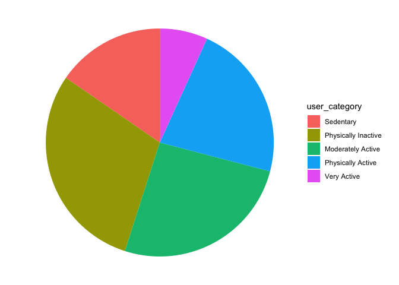<!-- -->

``` r
# Plot total steps vs. calories
ggplot(daily_activity, aes(x = steps, y = calories)) + 
  geom_point() +
  geom_smooth(method = lm, se = FALSE) +
  labs(title="Daily Steps vs. Calories")
```

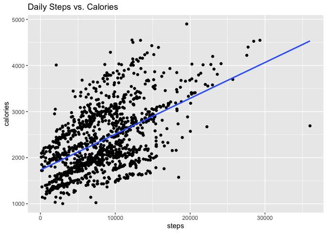<!-- -->

``` r
# Plot time asleep vs. total time in bed
ggplot(daily_activity, aes(x = minutes_asleep, y = time_in_bed)) + 
  geom_point() +
  geom_smooth(method = lm, se = FALSE) +
  labs(title="Minutes Asleep vs. Time in Bed")
```

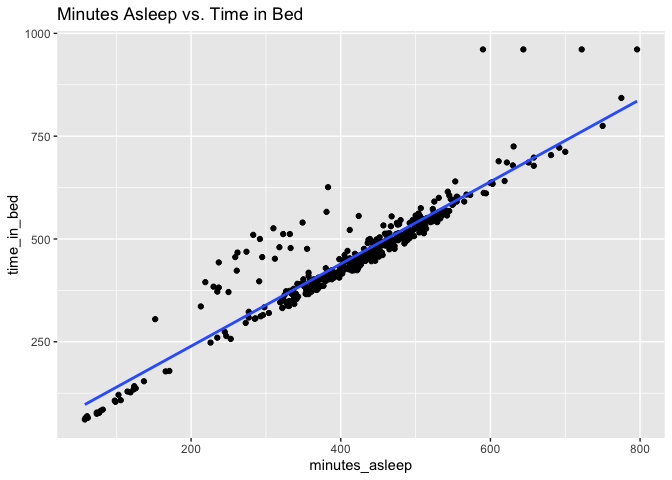<!-- -->

``` r
# Plot time asleep vs. sedentary minutes
ggplot(daily_activity, aes(x = minutes_asleep, y = sedentary_minutes)) + 
  geom_point() +
  geom_smooth(method = lm, se = FALSE) +
  labs(title = "Minutes Asleep vs. Sedentary Minutes")
```

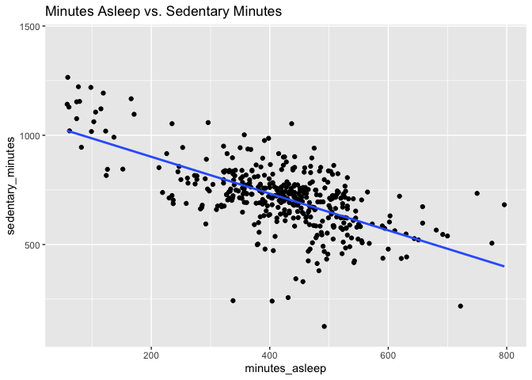<!-- -->

``` r
# In order to control for time in bed, we check the relationship between sleep score and sedentary minutes
ggplot(daily_activity, aes(x = sleep_score, y = sedentary_minutes)) + 
  geom_point() +
  geom_smooth(method = lm, se = FALSE) +
  labs(title = "Sleep Score vs. Sedentary Minutes")
```

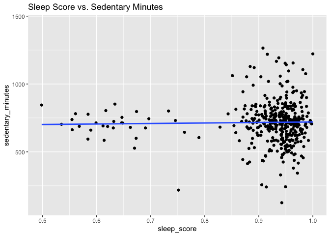<!-- -->

``` r
# And then to confirm once more, we'll check minutes asleep vs. intensity score
ggplot(daily_activity, aes(x = minutes_asleep, y = intensity_score)) + 
  geom_point() +
  geom_smooth(method = lm, se = FALSE) +
  labs(title = "Minutes Asleep vs. Intensity Score")
```

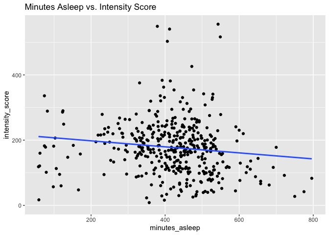<!-- -->

### Average Data vs. Weekday

``` r
# Calories burned per day
ggplot(weekday_avgs, aes(x = weekday, y = calories)) + 
  geom_histogram(stat = "identity", fill = "skyblue") +
  theme_minimal() +
  labs(title = "Average Calories per Weekday",
       x = "Weekday",
       y = "Average Calories")
```

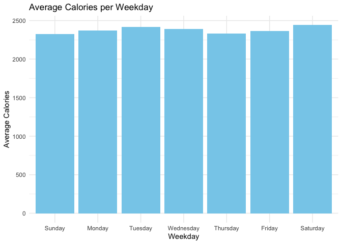<!-- -->

``` r
# Steps per day
ggplot(weekday_avgs, aes(x = weekday, y = steps)) +
  geom_histogram(stat = "identity", fill = "skyblue") +
  geom_hline(yintercept = 10000) + # recommended steps
  theme_minimal() +
  labs(title = "Average Steps per Weekday",
       x = "Weekday",
       y = "Average Steps")
```

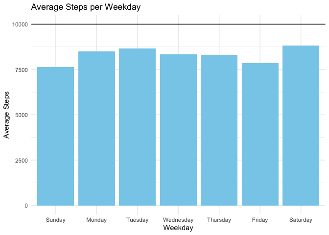<!-- -->

``` r
# Hours slept per day
ggplot(weekday_avgs, aes(x = weekday, y = minutes_asleep)) + 
  geom_histogram(stat = "identity", fill = "skyblue") +
  geom_hline(yintercept = 480) + # recommended sleep
  theme_minimal() +
  labs(title = "Average Sleep per Weekday",
       x = "Weekday",
       y = "Average Sleep")
```

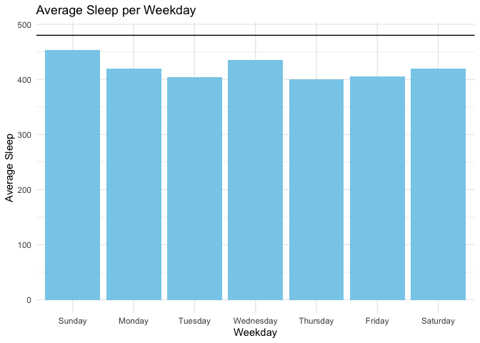<!-- -->

``` r
# Intensity per day
ggplot(weekday_avgs, aes(x = weekday, y = intensity_score)) + 
  geom_histogram(stat = "identity", fill = "skyblue") +
  geom_hline(yintercept = 150/7) + # recommended intensity
  geom_hline(yintercept = 300/7, linetype = "dashed") + # very active
  theme_minimal() +
  labs(title = "Average Sleep per Weekday",
       x = "Weekday",
       y = "Average Intensity")
```

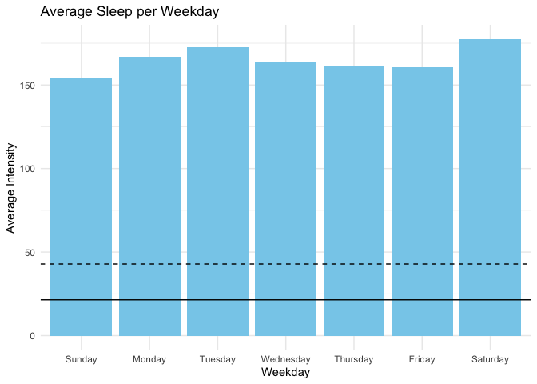<!-- -->

We can see that none of the averages quite reach the recommended 10000
steps or 480 minutes of sleep per day, yet the daily recommendation of
~22 minutes of intense minutes is easily cleared on each weekday. Even
the above-and-beyond recommendation of ~44 minutes per day, is about a
third of what each user averages per day. This tells us that either the
recommendation is too low or FitBit defines active minutes differently
than the American Heart Association.

### Data vs. Hour

``` r
# Calories per hour
ggplot(hourly_avgs, aes(x = hour, y = calories)) +
  geom_histogram(stat = "identity", fill = "skyblue") +
  theme_minimal() +
  labs(title = "Average Calories per Hour",
       x = "Hour",
       y = "Average Calories")
```

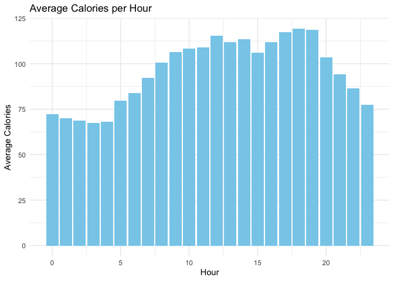<!-- -->

``` r
# Intensity per hour
ggplot(hourly_avgs, aes(x = hour, y = intensity)) + 
  geom_histogram(stat = "identity", fill = "skyblue") +
  theme_minimal() + 
  labs(title = "Average Intensity per Hour",
       x = "Hour",
       y = "Average Intensity")
```

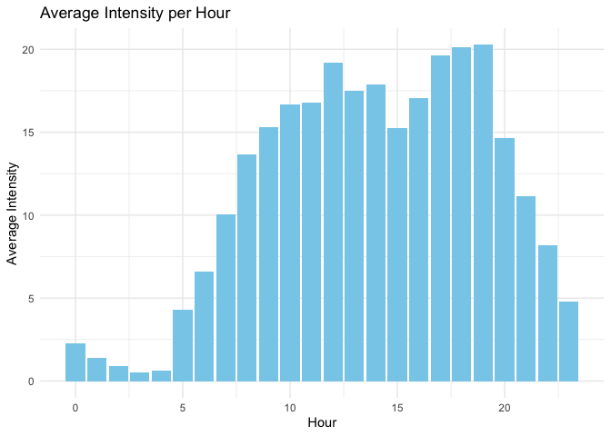<!-- -->

``` r
# Steps per hour
ggplot(hourly_avgs, aes(x = hour, y = steps)) + 
  geom_histogram(stat = "identity", fill = "skyblue") +
  theme_minimal() + 
  labs(title = "Average Steps per Hour",
       x = "Hour",
       y = "Average Steps")
```

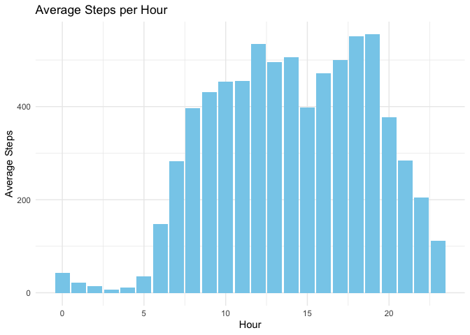<!-- -->

- All three metrics reach their minimums overnight, but while intensity
  and steps bottom out near zero, calories still remains at a moderate
  level.
- Our bodies obviously don’t take steps or perform activity while we
  sleep overnight, but they do maintain a basal metabolic rate of
  calorie burn even when we’re sleeping.
- Users are most active immediately around 6pm and 7pm (after work).
- The second most active time of day is the early afternoon (lunch
  time).
- We can infer that most of the users work full-time jobs.

### We can plot multiple columns against time by pivoting our data to long format. The variation between weekdays wasn’t as pronounced as between hours, so let’s try it with our hourly average data.

``` r
# Pivot to long data
hourly_avgs_long <- pivot_longer(hourly_avgs,
                                 cols = c(calories, steps, intensity),
                                 names_to = "metric",
                                 values_to = "value")

# Plot 
ggplot(hourly_avgs_long, aes(x = hour, y = value, fill = metric)) +
  geom_bar(stat = "identity", position = "dodge") +
  facet_wrap(~ metric, scales = "free") +
  theme(axis.text.x = element_text(angle = 45, vjust = 1, hjust = 1)) + 
  labs(title = "Calories, Intensity Minutes, and Steps by Hour", x = "Hour", y = "Value")
```

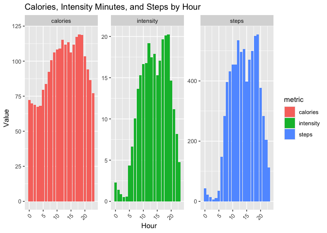<!-- -->

``` r
# Confirm correlations
cor(hourly_avgs[, .(steps, calories, intensity)])
```

    ##               steps  calories intensity
    ## steps     1.0000000 0.9924138 0.9948438
    ## calories  0.9924138 1.0000000 0.9989693
    ## intensity 0.9948438 0.9989693 1.0000000

We can clearly see an almost perfect correlation between all 3, with
values lowest in the early morning, rising steadily towards midday, with
an early evening spike. Calories remain relatively higher overnight
because we continue to burn calories while we sleep whereas steps and
intensity should be minimal.

### Next we’ll plot the different activity intensity levels against calories using the same pivoting method.

``` r
# Reshape the data from wide to long format
daily_activity_intensity_long <- pivot_longer(daily_activity,
                                     cols = c(lightly_active_minutes, fairly_active_minutes, very_active_minutes),
                                     names_to = "activity_type",
                                     values_to = "minutes")

# Make sure the intensity levels are ordered correctly
daily_activity_intensity_long$activity_type <- factor(daily_activity_intensity_long$activity_type, levels = c("lightly_active_minutes", "fairly_active_minutes", "very_active_minutes"))

# Create the plot
ggplot(daily_activity_intensity_long, aes(x = minutes, y = calories, color = activity_type)) +
  geom_point() +
  geom_smooth(method = "lm", se = TRUE) +
  facet_wrap(~ factor(activity_type, levels = c("very_active_minutes", "fairly_active_minutes", "lightly_active_minutes")), scales = "free_x", ncol = 1) +
  labs(title = "Calories vs Activity Minutes",
       x = "Minutes",
       y = "Calories",
       color = "Activity Type") +
  theme_minimal()
```

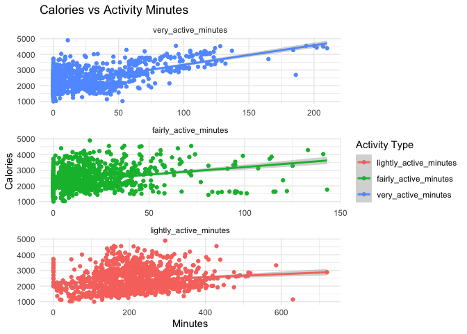<!-- -->

``` r
# Calculate correlations
cor(daily_activity[, .(calories, lightly_active_minutes, fairly_active_minutes, very_active_minutes)], use = "complete.obs")
```

    ##                         calories lightly_active_minutes fairly_active_minutes
    ## calories               1.0000000             0.13806884            0.28758920
    ## lightly_active_minutes 0.1380688             1.00000000            0.06412997
    ## fairly_active_minutes  0.2875892             0.06412997            1.00000000
    ## very_active_minutes    0.5863405            -0.04098602            0.28572058
    ##                        very_active_minutes
    ## calories                        0.58634050
    ## lightly_active_minutes         -0.04098602
    ## fairly_active_minutes           0.28572058
    ## very_active_minutes             1.00000000

We can that all active minutes are positively correlated with calories,
with correlations strengthening as the intensity of thoe minutes
increases.

## Export Data

### We can visualize multiple plots even more powerfully with Tableau, so let’s write our data to csv files and transfer them to Tableau.

``` r
# Export to CSV
write_csv(daily_activity, path='Git Repos/My Repos/bellabeat-fitness-tracker/bellabeat_case_study_files/fitbit_daily_activity_03122016_05122016.csv')
```

    ## Warning: The `path` argument of `write_csv()` is deprecated as of readr 1.4.0.
    ## ℹ Please use the `file` argument instead.
    ## This warning is displayed once every 8 hours.
    ## Call `lifecycle::last_lifecycle_warnings()` to see where this warning was
    ## generated.

``` r
write_csv(hourly_activity, path='Git Repos/My Repos/bellabeat-fitness-tracker/bellabeat_case_study_files/fitbit_hourly_activity_03122016_05122016.csv')
write_csv(daily_activity_intensity_long, path='Git Repos/My Repos/bellabeat-fitness-tracker/bellabeat_case_study_files/fitbit_daily_activity_intensity_long_03122016_05122016.csv')
```

# 6. Act

### Tableau Dashboards

Now that we’ve migrated our data to Tableau, we can create cleaner and
more descriptive visualizations.

## [User Categories](https://public.tableau.com/views/BellabeatCaseStudy-UserCategories/UserCategories?:language=en-US&:sid=&:redirect=auth&:display_count=n&:origin=viz_share_link)

Our first dashboard is a breakdown of our User Categories that
visualizes the data by user type:

<div id="viz1729791998047" class="tableauPlaceholder"
style="position: relative">

<noscript>

<a href='#'></a>
</noscript>

<object class="tableauViz" style="display:none;">

<param name='host_url' value='https%3A%2F%2Fpublic.tableau.com%2F' />
<param name='embed_code_version' value='3' />
<param name='site_root' value='' /><param name='name' value='BellabeatCaseStudy-UserCategories&#47;UserCategories' /><param name='tabs' value='no' /><param name='toolbar' value='yes' /><param name='static_image' value='https:&#47;&#47;public.tableau.com&#47;static&#47;images&#47;Be&#47;BellabeatCaseStudy-UserCategories&#47;UserCategories&#47;1.png' />
<param name='animate_transition' value='yes' /><param name='display_static_image' value='yes' /><param name='display_spinner' value='yes' /><param name='display_overlay' value='yes' /><param name='display_count' value='yes' /><param name='language' value='en-US' />
</object>

</div>

<script>
var divElement = document.getElementById('viz1729791998047');                    var vizElement = divElement.getElementsByTagName('object')[0];                    if ( divElement.offsetWidth > 800 ) { vizElement.style.width='1366px';vizElement.style.height='795px';} else if ( divElement.offsetWidth > 500 ) { vizElement.style.width='1366px';vizElement.style.height='795px';} else { vizElement.style.width='100%';vizElement.style.height='1227px';}                     var scriptElement = document.createElement('script');                    scriptElement.src = 'https://public.tableau.com/javascripts/api/viz_v1.js';                    vizElement.parentNode.insertBefore(scriptElement, vizElement);
</script>

- We can see that the users are fairly spread out amongst the categories
  (Tudor-Locke and Bassett classification system), aside from the 2
  users in the ‘Very Active’ category.
- We’ve replotted a couple of graphs that we plotted using R, but now we
  we’ve colored each data point based on that user’s category.
- Since the categories are based on steps, we’d expect the colors to
  dark as steps increase, but we can also see clearly defined areas of
  the graph along the Calories and Intensity Score axes.
- The R-Squared value of Intensity Score vs. Calories is ~.39 while
  Steps vs. Calories is ~.29, so increasing intensity score is more
  beneficial than taking more steps.
- Unsurprisingly, there is a steady increase in steps and intensity
  score as the user category level increases, but there are also some
  interesting measures.
- The Moderately Active group burned more calories on average the the
  Physically Active group.
- This might give us some insight into why the Moderately Active group
  burned more calories on average. The Very Active Minutes may be the
  key to higher calorie burn.
- The Very Active group has some of the least lightly and fairly active
  minutes, while having more than double the very active minutes as any
  other group.

## [Intensity Breakdown](https://public.tableau.com/views/BellabeatCaseStudy-IntensityBreakdown/IntensityBreakdown?:language=en-US&:sid=&:redirect=auth&:display_count=n&:origin=viz_share_link)

Our next dashboard is a side-by-side look at the relationship between
the intensity level of active minutes and calories, similar to the one
we plotted with R, but this time adding steps.

<div id="viz1729792836209" class="tableauPlaceholder"
style="position: relative">

<noscript>

<a href='#'></a>
</noscript>

<object class="tableauViz" style="display:none;">

<param name='host_url' value='https%3A%2F%2Fpublic.tableau.com%2F' />
<param name='embed_code_version' value='3' />
<param name='site_root' value='' /><param name='name' value='BellabeatCaseStudy-IntensityBreakdown&#47;IntensityBreakdown' /><param name='tabs' value='no' /><param name='toolbar' value='yes' /><param name='static_image' value='https:&#47;&#47;public.tableau.com&#47;static&#47;images&#47;Be&#47;BellabeatCaseStudy-IntensityBreakdown&#47;IntensityBreakdown&#47;1.png' />
<param name='animate_transition' value='yes' /><param name='display_static_image' value='yes' /><param name='display_spinner' value='yes' /><param name='display_overlay' value='yes' /><param name='display_count' value='yes' /><param name='language' value='en-US' />
</object>

</div>

<script>
var divElement = document.getElementById('viz1729792836209');                    var vizElement = divElement.getElementsByTagName('object')[0];                    if ( divElement.offsetWidth > 800 ) { vizElement.style.width='1366px';vizElement.style.height='795px';} else if ( divElement.offsetWidth > 500 ) { vizElement.style.width='1366px';vizElement.style.height='795px';} else { vizElement.style.width='100%';vizElement.style.height='727px';}                     var scriptElement = document.createElement('script');                    scriptElement.src = 'https://public.tableau.com/javascripts/api/viz_v1.js';                    vizElement.parentNode.insertBefore(scriptElement, vizElement);              
</script>

- In all cases, we can see that an increase in any active minutes is
  associated with an increase in calories and steps.
- What’s interesting is that we can see the correlation (trend line)
  between active minutes and calories/steps increase as the intensity of
  those active minutes increases.
- This further supports that observation that the Moderately Active
  group burned more calories on average than the higher intensity
  Physically Active group because they had more very active minutes.

## [Averages by Day/Time](https://public.tableau.com/views/BellabeatCaseStudy-AveragesbyDayTime/AveragesbyDayTime?:language=en-US&:sid=&:redirect=auth&:display_count=n&:origin=viz_share_link)

Next we can look at our average data grouped by day of the week and time
instead of user category. These plots were also already done using R,
but are now presented with easier to read labels, color coding,
annotations, and general formatting. The most interesting difference
from our R generated plots is the separation of weekday and weekend
plots.

<div id="viz1729792814664" class="tableauPlaceholder"
style="position: relative">

<noscript>

<a href='#'></a>
</noscript>

<object class="tableauViz" style="display:none;">

<param name='host_url' value='https%3A%2F%2Fpublic.tableau.com%2F' />
<param name='embed_code_version' value='3' />
<param name='site_root' value='' /><param name='name' value='BellabeatCaseStudy-AveragesbyDayTime&#47;AveragesbyDayTime' /><param name='tabs' value='no' /><param name='toolbar' value='yes' /><param name='static_image' value='https:&#47;&#47;public.tableau.com&#47;static&#47;images&#47;Be&#47;BellabeatCaseStudy-AveragesbyDayTime&#47;AveragesbyDayTime&#47;1.png' />
<param name='animate_transition' value='yes' /><param name='display_static_image' value='yes' /><param name='display_spinner' value='yes' /><param name='display_overlay' value='yes' /><param name='display_count' value='yes' /><param name='language' value='en-US' />
</object>

</div>

<script>
var divElement = document.getElementById('viz1729792814664');                    var vizElement = divElement.getElementsByTagName('object')[0];                    if ( divElement.offsetWidth > 800 ) { vizElement.style.width='1366px';vizElement.style.height='795px';} else if ( divElement.offsetWidth > 500 ) { vizElement.style.width='1366px';vizElement.style.height='795px';} else { vizElement.style.width='100%';vizElement.style.height='1977px';}                     var scriptElement = document.createElement('script');                    scriptElement.src = 'https://public.tableau.com/javascripts/api/viz_v1.js';                    vizElement.parentNode.insertBefore(scriptElement, vizElement);            
</script>

- Our Weekdays plot looks a lot similar to our hourly averages plot,
  which makes sense given that there are only 2 weekend days and 5
  weekday days.
- There is still a peak from 5pm to 7pm indicating a preference for post
  work rather than pre work exercise.
- Our Weekends plot shows a much more gradual increase in activity until
  a 2pm peak.
- While activity very gently and gradually declines over the second half
  of the day on weekends, there is a small spike at 7pm.
- This might users engaging in evening exercise, keeping with their
  weekday schedule.
- It might also be users partaking in the evening activities that
  generally accompany weekends, like going out.

## [Sleep Data](https://public.tableau.com/views/BellabeatCaseStudy-SleepData/SleepData?:language=en-US&:sid=&:redirect=auth&:display_count=n&:origin=viz_share_link)

And last, but not least, we have our sleep data. We’ll end with this one
remembering that we only had 8 users, so our data isn’t the most robust
and is highly susceptible to skewing. This dashboard presents the sleep
data relative to user category.

<div id="viz1729792844748" class="tableauPlaceholder"
style="position: relative">

<noscript>

<a href='#'></a>
</noscript>

<object class="tableauViz" style="display:none;">

<param name='host_url' value='https%3A%2F%2Fpublic.tableau.com%2F' />
<param name='embed_code_version' value='3' />
<param name='site_root' value='' /><param name='name' value='BellabeatCaseStudy-SleepData&#47;SleepData' /><param name='tabs' value='no' /><param name='toolbar' value='yes' /><param name='static_image' value='https:&#47;&#47;public.tableau.com&#47;static&#47;images&#47;Be&#47;BellabeatCaseStudy-SleepData&#47;SleepData&#47;1.png' />
<param name='animate_transition' value='yes' /><param name='display_static_image' value='yes' /><param name='display_spinner' value='yes' /><param name='display_overlay' value='yes' /><param name='display_count' value='yes' /><param name='language' value='en-US' />
</object>

</div>

<script>
var divElement = document.getElementById('viz1729792844748');                    var vizElement = divElement.getElementsByTagName('object')[0];                    if ( divElement.offsetWidth > 800 ) { vizElement.style.width='1366px';vizElement.style.height='795px';} else if ( divElement.offsetWidth > 500 ) { vizElement.style.width='1366px';vizElement.style.height='795px';} else { vizElement.style.width='100%';vizElement.style.height='1327px';}                     var scriptElement = document.createElement('script');                    scriptElement.src = 'https://public.tableau.com/javascripts/api/viz_v1.js';                    vizElement.parentNode.insertBefore(scriptElement, vizElement);      
</script>

- By plotting Steps vs. Sleep Score, I wanted to see if there was any
  relationship between a user’s activity and their sleep, even when
  separating the user categories. At first it seemed like there was
  none, until I plotted average sleep scores by user category.
- There was an extremely small, but steady percentage increase in sleep
  score going from category to category except for the the Physically
  Active Category, which had a relatively large decrease.
- I then color coded the data points on the original plot and realized
  that there were a large amount of Physically Active data points - they
  were all from User ID: 3977333714
- Adding a box plot onto the graph, we can see that all of that user’s
  data points fell well below the lower whisker.
- I decided to replot everything filtering out the outliers.
- We can see that the averages have leveled out much more gently.
- The percentage increase is really only significant in the Very Active
  group, but that group only contains 2 people (and possibly only 1 with
  sleep data).
- On the scatter plot we can see some very interesting trends.
- As the user category increases, so does the R-Squared value (with the
  exception of the very small Very Active group).
- It would seem that users who are generally more active are more
  resilient in their ability to sleep after higher activity days.
- Sedentary and Physically Inactive users tend to not sleep well after a
  high step count day whereas Moderately Active and Physically Active
  users actually sleep a little better.
- While the Very Active group sleeps a little worse the more steps they
  take, they still sleep far better than the other groups.
- The trend lines of the first four categories all seem to intersect
  around 3500 steps and a sleep score of 94%.
- We can’t say exactly why from this data alone, but what the data tells
  us is that if any user (besides a Very Active user) has a 3500 step
  day, they will also have a 94% sleep score night (and vice versa)
- We can assume that the steps from the day are more likely to cause the
  sleep score because they come first, but we also can’t conclude that
  steps affect sleep score in general.

## Conclusion

### As a reminder, the business task was to analyze smart device usage data in order to gain insight into how consumers use non-Bellabeat smart devices, while answering three specific questions:

1.  What are some trends in smart device usage?
2.  How could these trends apply to Bellabeat customers?
3.  How could these trends help influence Bellabeat marketing strategy?

#### 1. What are some trends in smart device usage?

- Users are segmented fairly evenly by activity level
- Users are significantly more active than the average American
- Users work 9-5 jobs
- Users prefer evening exercise
- Higher intensity level is more beneficial than more steps, although
  the two are strongly correlated anyways
- Saturdays, Mondays, and Tuesdays are the most active days
- Sundays, Thursdays, and Fridays are the least active days
- All users consistently surpass the AHA’s daily recommendation of 22
  active minutes (and even the above-and-beyond recommendation of 43) by
  a large amount
- Users who were generally less active had their sleep negatively
  affected by sporadic, high activity days
- The inverse is also true, where users who were generally more active
  slept better after high activity days
- The strongest indicator of more time asleep was more time in bed

#### 2. How could these trends apply to Bellabeat customers?

Bellabeat customers could benefit from the following: \* Dynamic goals
rather than static ones - Sundays are low activity days, so the
Bellabeat app could recommend a step or active minute goal based on the
user’s Sunday average steps or active minutes \* Gamified Intensity
Score - Presenting the idea of Very Active Minutes being more “valuable”
than Fairly or Lightly Active Minutes \* Bedtime Reminders - If users
want to sleep more, the best way to do that is to go to bed earlier \*
Daily Recaps - A nightly summary of the day’s activity, which can also
provide recommendations for sleep duration or activity level for the
following day(s)

#### 3. How could these trends help influence Bellabeat marketing strategy?

We know that Bellabeat’s mission is to use “beautifully designed
\[wellness\] technology to inform and inspire women.” Based on that
information, we can narrow our target demographic to women who might not
have high level knowledge of their own health, but value insightful
information and most importantly, want to use that information to
improve their own health. \* We know that FitBit users are probably full
time employees, who prefer to exercise after work, so one strategy we
could employ would be to target potential customers during the post work
commute. Whether that’s traditional advertising on high traffic roads or
in public transportation spaces, we could present Bellabeat products as
a way to take control of their health after a long day of sedentary
work. \* Bellabeat focuses more on digital marketing, investing in
Google Search, so we could target potential customers who search for
more basic health questions like “how do I lose weight?” or “how many
steps should I take?” These questions are indicative of a population
that wants to improve their health, but maybe don’t know where to start.
Bellabeat is there to get them started. \* Knowing that users exercise a
lot on Mondays and Tuesdays, but far less for the rest of the work week,
we can narrow our digital marketing to Wednesdays to inspire potential
customers to continue their strong start, using Bellabeat products as
inspirational tools.

### Valuable things I learned while working with this data:

- Data tables vs. data frames - more efficient functions and data table
  notation resembles SQL Selects.
- Data permaneance - learning to make sure that any transformations made
  didn’t cause any unintended consequences.
- Date formats - learning to work with POSIX functions as well as
  transforming dates into strings to be read more easily by Excel and
  Tableau.

### Data Limitations:

- Unless the FitBit was worn all day (usually not the case), the daily
  data will be at least slightly skewed.
- Our sleep data only had 24 users, most of whom recorded their sleep on
  less than 30 days (Kept it in the analysis for practice/demonstration
  purposes).
- We had to completely scrap our weight data which only had 13 users,
  only 3 of which logged their weight more than 4 times.
- We did not have age, gender, height, or weight data, all of which are
  extremely deterministic when it comes to health and activity.
- One of the metrics we used the most was active minute intensity
  (lightly, fairly, and very). When measured against the American Heart
  Association’s recommendation of 150 weekly active minutes, every user
  went way beyond, leading us to question FitBit’s definition of active
  minute intensity.

### Thanks for taking the time to read all of this! If you’ve made it this far, you might be:

- considering me for an open position (thank you again for your time and
  consideration)
- my mom, incredibly proud of her son’s work (whether it be macaroni art
  or data analysis)
- super interested in FitBit data and/or data cleaning! (cool!)
